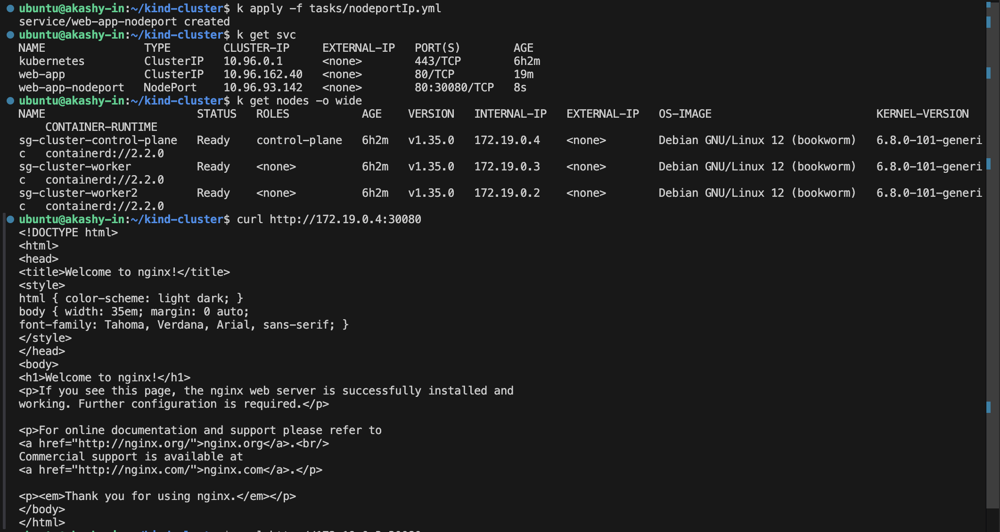
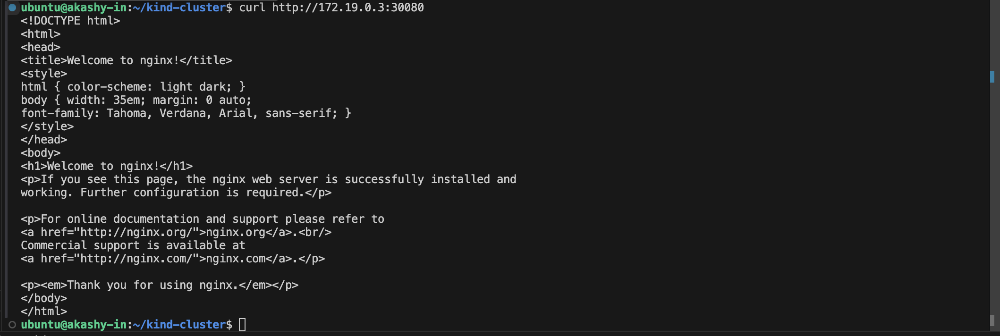
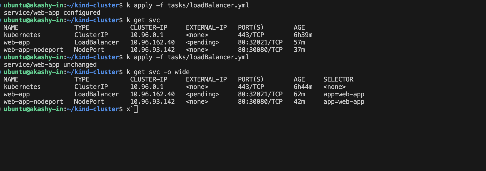
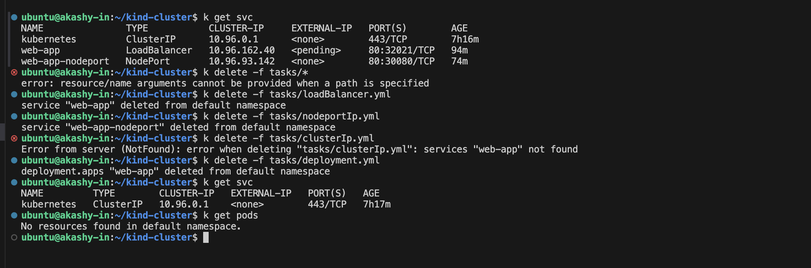

# Day 53: Kubernetes Services Tasks

## Task: 1
Created a deployment of Nginx with 3 replicas. and restart the pods and see the ip changes.

-----
## Task: 2 and 3
Created ClusterIP and create a test-pod and goes inside and curl the clusterip and check the response.
also tried the full dns name and resolve the ip thorugh dns name and got same result.

-----

-----

-----

## Task: 4
Created a NodePort and expose its svc and curl on nodes Internal Ip on exposed port :30080 and got the result 

-----

-----

## Task: 5 and 6
Yes, I applied loadbalacer svc and it is still showing pending for external ip.
beacuse it is running on kind cluster. 

-----

## Task: 7
Cleaned Up everything .

------

## Learning 
- `selector` in a Service must match `labels` on the Pods — if they do not match, the Service routes traffic to nothing
- `kubectl get endpoints <service-name>` shows which Pod IPs a Service is currently routing to
- `port` is what the Service listens on; `targetPort` is what the Pod listens on — they do not have to be the same number
- NodePort range is 30000-32767; if you do not specify `nodePort`, Kubernetes picks one automatically
- Use `kubectl describe service <name>` to see the full configuration including Endpoints
- `kubectl get services -o wide` shows the selector each service uses
- To test ClusterIP services, you must test from inside the cluster (use a temporary pod)
