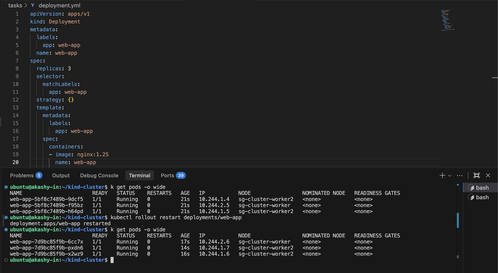
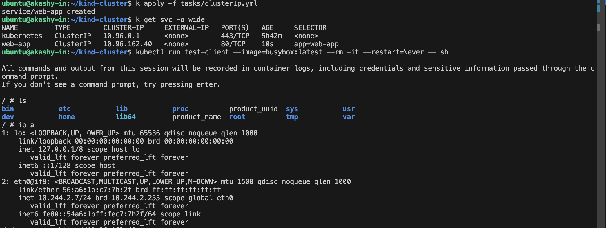
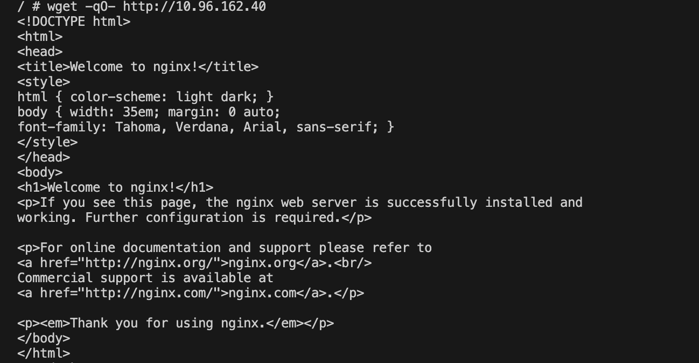
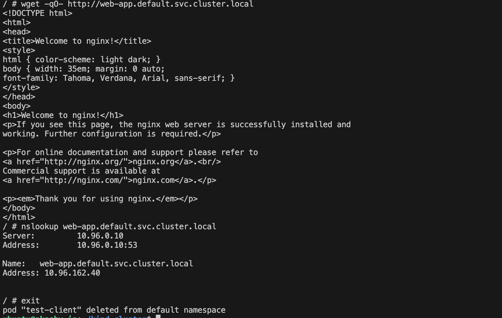

# Day 53: Kubernetes Services Tasks

## Task: 1
Created a deployment of Nginx with 3 replicas. and restart the pods and see the ip changes.

-----
## Task: 2 and 3
Created ClusterIP and create a test-pod and goes inside and curl the clusterip and check the response.
also tried the full dns name and resolve the ip thorugh dns name and got same result.

-----

-----

-----

## Task: 4